# ELF Format Cheatsheet — Bản dịch tiếng Việt kèm ảnh gốc

> Nguồn gốc: Gist `elf_format_cheatsheet.md` của `x0nu11byt3`  
> Ghi chú ảnh: Bản này dùng **16 ảnh gốc trong phần nội dung chính của Gist**. File `.md` đã được sửa sang đường dẫn local `images/...` để đưa lên GitHub repository. Chạy `python download_images.py` để tải ảnh vào thư mục `images/`. Không dùng ảnh tự vẽ/tự chế.  
> Ghi chú dịch: Các thuật ngữ/ký hiệu nên giữ nguyên trong tiếng Anh như `ELF`, `section`, `segment`, `Program Header`, `Section Header`, `dynamic linker`, `relocation`, `GOT`, `PLT`, `PIC/PIE`, `ASLR`, tên struct, macro, section name và symbol name được giữ nguyên để dễ tra cứu tài liệu kỹ thuật.

---

## Introduction

**Executable and Linkable Format (ELF)** là định dạng binary mặc định trên các hệ thống dựa trên Linux.

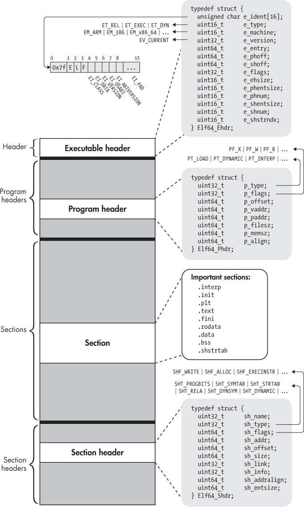

## Compilation

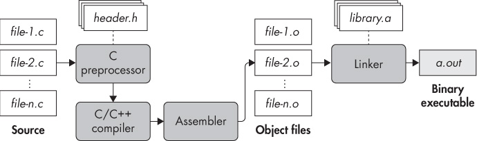

## Executable Headers (`Ehdr`)

Đây là phần duy nhất của ELF bắt buộc phải nằm tại một vị trí cụ thể, tức là ở đầu file ELF.

Nó định nghĩa các thông tin cơ bản, ví dụ như **file magic number** để biết một file có phải ELF hay không. Nó cũng định nghĩa loại ELF, kiến trúc, và một số tùy chọn liên kết tới các phần khác trong file ELF.

### 32-bit struct

```c
#define EI_NIDENT (16)

typedef struct
{
  unsigned char e_ident[EI_NIDENT]; /* Magic number and other info */
  Elf32_Half    e_type;             /* Object file type */
  Elf32_Half    e_machine;          /* Architecture */
  Elf32_Word    e_version;          /* Object file version */
  Elf32_Addr    e_entry;            /* Entry point virtual address */
  Elf32_Off     e_phoff;            /* Program header table file offset */
  Elf32_Off     e_shoff;            /* Section header table file offset */
  Elf32_Word    e_flags;            /* Processor-specific flags */
  Elf32_Half    e_ehsize;           /* ELF header size in bytes */
  Elf32_Half    e_phentsize;        /* Program header table entry size */
  Elf32_Half    e_phnum;            /* Program header table entry count */
  Elf32_Half    e_shentsize;        /* Section header table entry size */
  Elf32_Half    e_shnum;            /* Section header table entry count */
  Elf32_Half    e_shstrndx;         /* Section header string table index */
} Elf32_Ehdr;
```

### 64-bit struct

```c
typedef struct
{
  unsigned char e_ident[EI_NIDENT]; /* Magic number and other info */
  Elf64_Half    e_type;             /* Object file type */
  Elf64_Half    e_machine;          /* Architecture */
  Elf64_Word    e_version;          /* Object file version */
  Elf64_Addr    e_entry;            /* Entry point virtual address */
  Elf64_Off     e_phoff;            /* Program header table file offset */
  Elf64_Off     e_shoff;            /* Section header table file offset */
  Elf64_Word    e_flags;            /* Processor-specific flags */
  Elf64_Half    e_ehsize;           /* ELF header size in bytes */
  Elf64_Half    e_phentsize;        /* Program header table entry size */
  Elf64_Half    e_phnum;            /* Program header table entry count */
  Elf64_Half    e_shentsize;        /* Section header table entry size */
  Elf64_Half    e_shnum;            /* Section header table entry count */
  Elf64_Half    e_shstrndx;         /* Section header string table index */
} Elf64_Ehdr;
```

`EI_NIDENT` là kích thước theo byte của entry đầu tiên trong struct, tức `e_ident`.

Nó chứa **ELF magic header** và một số đặc tả cơ bản của file.

### Giá trị

- `e_ident`: Mảng 16 byte dùng để nhận diện ELF object. Nó luôn bắt đầu bằng `\x7fELF`.
- `e_type`: Chỉ định loại ELF:
  - `ET_NONE` — chưa xác định / không chỉ định.
  - `ET_EXEC` — executable file, tức file thực thi ELF.
  - `ET_DYN` — shared object, tức thư viện hoặc executable được dynamic-link.
  - `ET_REL` — relocatable file, ví dụ file object `.o`.
  - `ET_CORE` — core dump file.
- `e_machine`: Kiến trúc đích.
- `e_version`: Phiên bản file ELF.
- `e_entry`: Địa chỉ entry point.
- `e_phoff`: Offset của Program Header (`Phdr`).
- `e_shoff`: Offset của Section Header (`Shdr`).
- `e_flags`: Các flag phụ thuộc processor.
- `e_ehsize`: Kích thước `Ehdr`, theo byte. Thường là 64 byte với ELF 64-bit và 52 byte với ELF 32-bit.
- `e_phentsize`: Kích thước một entry trong `Phdr`.
- `e_phnum`: Số lượng entry trong `Phdr`.
- `e_shentsize`: Kích thước một entry trong `Shdr`.
- `e_shnum`: Số lượng entry trong `Shdr`.
- `e_shstrndx`: Index của `Shdr string table`, thường là `.shstrtab`, chứa các chuỗi kết thúc bằng NULL với tên của từng section.

**Lưu ý:** `e_phoff` và `e_shoff` là offset trong file ELF, còn `e_entry` là virtual address.

### Type definitions cần biết

#### `e_type` defines

```c
#define ET_NONE   0       /* No file type */
#define ET_REL    1       /* Relocatable file */
#define ET_EXEC   2       /* Executable file */
#define ET_DYN    3       /* Shared object file */
#define ET_CORE   4       /* Core file */
#define ET_NUM    5       /* Number of defined types */
#define ET_LOOS   0xfe00  /* OS-specific range start */
#define ET_HIOS   0xfeff  /* OS-specific range end */
#define ET_LOPROC 0xff00  /* Processor-specific range start */
#define ET_HIPROC 0xffff  /* Processor-specific range end */
```

#### `e_machine` defines

Danh sách `EM_*` định nghĩa kiến trúc máy đích. Một số giá trị thường gặp:

```c
#define EM_NONE        0    /* No machine */
#define EM_386         3    /* Intel 80386 */
#define EM_ARM         40   /* ARM */
#define EM_X86_64      62   /* AMD x86-64 architecture */
#define EM_AARCH64     183  /* ARM AARCH64 */
#define EM_RISCV       243  /* RISC-V */
#define EM_BPF         247  /* Linux BPF -- in-kernel virtual machine */
```

Trong file gốc có liệt kê rất nhiều `EM_*` khác như `EM_SPARC`, `EM_MIPS`, `EM_PPC`, `EM_PPC64`, `EM_S390`, `EM_AVR`, `EM_CUDA`, `EM_TILEGX`, `EM_CSKY`, v.v. Đây là các hằng số trong `elf.h` dùng để biểu diễn kiến trúc target.

#### `e_version` defines

```c
#define EV_NONE    0   /* Invalid ELF version */
#define EV_CURRENT 1   /* Current version */
#define EV_NUM     2
```

---

## Section Headers (`Shdr`)

Code và data được chia thành các khối liên tiếp, không chồng lấn nhau, gọi là **sections**.

Một section đơn giản là vùng dùng để lưu data hoặc code. Các đặc tả của nó nằm trong **section header**, bao gồm kích thước, offset và các thông tin cần thiết khác.

Mỗi section đều có một section header mô tả nó.

### 32-bit struct

```c
typedef struct
{
  Elf32_Word sh_name;      /* Section name (string tbl index) */
  Elf32_Word sh_type;      /* Section type */
  Elf32_Word sh_flags;     /* Section flags */
  Elf32_Addr sh_addr;      /* Section virtual addr at execution */
  Elf32_Off  sh_offset;    /* Section file offset */
  Elf32_Word sh_size;      /* Section size in bytes */
  Elf32_Word sh_link;      /* Link to another section */
  Elf32_Word sh_info;      /* Additional section information */
  Elf32_Word sh_addralign; /* Section alignment */
  Elf32_Word sh_entsize;   /* Entry size if section holds table */
} Elf32_Shdr;
```

### 64-bit struct

```c
typedef struct
{
  Elf64_Word  sh_name;      /* Section name (string tbl index) */
  Elf64_Word  sh_type;      /* Section type */
  Elf64_Xword sh_flags;     /* Section flags */
  Elf64_Addr  sh_addr;      /* Section virtual addr at execution */
  Elf64_Off   sh_offset;    /* Section file offset */
  Elf64_Xword sh_size;      /* Section size in bytes */
  Elf64_Word  sh_link;      /* Link to another section */
  Elf64_Word  sh_info;      /* Additional section information */
  Elf64_Xword sh_addralign; /* Section alignment */
  Elf64_Xword sh_entsize;   /* Entry size if section holds table */
} Elf64_Shdr;
```

### Giá trị

- `sh_name`: Index vào string table. Nếu bằng 0 thì section không có tên. Thường liên quan `.shstrtab`.
- `sh_type`: Loại section.
  - `SHT_NULL`: Entry trong section table không được dùng.
  - `SHT_PROGBITS`: Program data, ví dụ machine instructions hoặc constants.
  - `SHT_SYMTAB`: Symbol table tĩnh.
  - `SHT_STRTAB`: String table.
  - `SHT_RELA`: Relocation entries có addend.
  - `SHT_HASH`: Symbol hash table.
  - `SHT_DYNAMIC`: Dynamic linking information.
  - `SHT_NOTE`: Notes.
  - `SHT_NOBITS`: Dữ liệu chưa khởi tạo.
  - `SHT_REL`: Relocation entries không có addend.
  - `SHT_SHLIB`: Reserved.
  - `SHT_DYNSYM`: Dynamic linker symbol table.
- `sh_flags`: Thông tin bổ sung về section.
  - `SHF_WRITE`: Có thể ghi khi runtime.
  - `SHF_ALLOC`: Section sẽ được load vào virtual memory khi runtime.
  - `SHF_EXECINSTR`: Chứa executable instructions.
- `sh_addr`: Virtual address của section khi execution.
- `sh_offset`: Offset của section trong file ELF.
- `sh_size`: Kích thước section, theo byte.
- `sh_link`: Link tới section khác. Ví dụ `SHT_SYMTAB`, `SHT_DYNSYM`, hoặc `SHT_DYNAMIC` thường có string table liên quan.
- `sh_info`: Thông tin bổ sung của section.
- `sh_addralign`: Alignment của section.
- `sh_entsize`: Kích thước mỗi entry nếu section chứa table, ví dụ symbol table hoặc relocation table.

Tất cả section headers định nghĩa các section đều nằm trong **section header table**.

Để load và execute binary trong một process, cần một cách tổ chức code và data khác với cách dùng cho linking. Vì vậy ELF executable định nghĩa thêm một tổ chức logic khác gọi là **segments**. Segments được dùng tại execution time, còn sections được dùng tại link time.

Sections là tùy chọn; chúng chủ yếu là metadata cho debuggers. **Program headers** mới là phần quyết định ELF binary được load vào memory như thế nào.

Vì vậy, section headers không được load vào memory.

### `sh_type` defines

```c
#define SHT_NULL          0          /* Section header table entry unused */
#define SHT_PROGBITS      1          /* Program data */
#define SHT_SYMTAB        2          /* Symbol table */
#define SHT_STRTAB        3          /* String table */
#define SHT_RELA          4          /* Relocation entries with addends */
#define SHT_HASH          5          /* Symbol hash table */
#define SHT_DYNAMIC       6          /* Dynamic linking information */
#define SHT_NOTE          7          /* Notes */
#define SHT_NOBITS        8          /* Program space with no data (bss) */
#define SHT_REL           9          /* Relocation entries, no addends */
#define SHT_SHLIB         10         /* Reserved */
#define SHT_DYNSYM        11         /* Dynamic linker symbol table */
#define SHT_INIT_ARRAY    14         /* Array of constructors */
#define SHT_FINI_ARRAY    15         /* Array of destructors */
#define SHT_PREINIT_ARRAY 16         /* Array of pre-constructors */
#define SHT_GROUP         17         /* Section group */
#define SHT_SYMTAB_SHNDX  18         /* Extended section indices */
#define SHT_LOOS          0x60000000 /* Start OS-specific */
#define SHT_GNU_HASH      0x6ffffff6 /* GNU-style hash table */
#define SHT_GNU_verdef    0x6ffffffd /* Version definition section */
#define SHT_GNU_verneed   0x6ffffffe /* Version needs section */
#define SHT_GNU_versym    0x6fffffff /* Version symbol table */
#define SHT_LOPROC        0x70000000 /* Start of processor-specific */
#define SHT_HIPROC        0x7fffffff /* End of processor-specific */
#define SHT_LOUSER        0x80000000 /* Start of application-specific */
#define SHT_HIUSER        0x8fffffff /* End of application-specific */
```

### `sh_flags` defines

```c
#define SHF_WRITE            (1 << 0)  /* Writable */
#define SHF_ALLOC            (1 << 1)  /* Occupies memory during execution */
#define SHF_EXECINSTR        (1 << 2)  /* Executable */
#define SHF_MERGE            (1 << 4)  /* Might be merged */
#define SHF_STRINGS          (1 << 5)  /* Contains nul-terminated strings */
#define SHF_INFO_LINK        (1 << 6)  /* sh_info contains SHT index */
#define SHF_LINK_ORDER       (1 << 7)  /* Preserve order after combining */
#define SHF_OS_NONCONFORMING (1 << 8)  /* Non-standard OS specific handling required */
#define SHF_GROUP            (1 << 9)  /* Section is member of a group */
#define SHF_TLS              (1 << 10) /* Section hold thread-local data */
#define SHF_COMPRESSED       (1 << 11) /* Section with compressed data */
#define SHF_MASKOS           0x0ff00000 /* OS-specific */
#define SHF_MASKPROC         0xf0000000 /* Processor-specific */
#define SHF_ORDERED          (1 << 30) /* Special ordering requirement */
#define SHF_EXCLUDE          (1U << 31) /* Section excluded unless referenced/allocated */
```

---

## Sections

Entry đầu tiên trong section header table của mọi ELF file được chuẩn ELF định nghĩa là một entry NULL. Type của entry này là `SHT_NULL`, và toàn bộ field trong section header được set bằng 0.

Các section thường gặp:

- `.init`: Code executable dùng cho các tác vụ khởi tạo, chạy trước mọi code khác trong binary. Nó có flag `SHF_EXECINSTR`.
- `.fini`: Ngược lại với `.init`, chứa executable code chạy sau khi main program hoàn tất.
- `.text`: Nơi chứa code chính của program. Nó có flag `SHF_EXECINSTR`, và type là `SHT_PROGBITS` vì chứa user-defined code.
- `.bss`: Chứa dữ liệu chưa khởi tạo, type `SHT_NOBITS`. Nó không chiếm dung lượng trên disk để tiết kiệm không gian; dữ liệu thường được khởi tạo thành 0 tại runtime. Section này writable.
- `.data`: Chứa dữ liệu đã khởi tạo của program. Writable, type `SHT_PROGBITS`.
- `.rodata`: Chứa read-only data, ví dụ strings dùng bởi code. Nếu dữ liệu cần writable thì dùng `.data`. Ví dụ hardcoded strings dùng cho `printf`.
- `.plt`: Viết tắt của **Procedure Linkage Table**. Đây là code dùng cho dynamic linking, giúp gọi external functions từ shared libraries với sự hỗ trợ của GOT.
- `.got.plt`: Table lưu địa chỉ đã resolve của external functions. Mặc định writable vì Lazy Binding được dùng mặc định, trừ khi dùng RELRO hoặc export `LD_BIND_NOW` để resolve toàn bộ imported functions ngay lúc program initialization.
- `.rel.*`: Chứa thông tin về cách sửa/điều chỉnh các phần của ELF object hoặc process image khi linking/runtime. Type `SHT_REL`.
- `.rela.*`: Giống `.rel.*` nhưng có addend. Type `SHT_RELA`.
- `.dynamic`: Chứa dynamic linking structures và objects. Nó chứa table các struct `ElfN_Dyn`, đồng thời chứa pointers tới các thông tin quan trọng mà dynamic linker cần, ví dụ dynamic string table, dynamic symbol table, `.got.plt`, dynamic relocation section, thông qua các tag `DT_STRTAB`, `DT_SYMTAB`, `DT_PLTGOT`, `DT_RELA`.
- `.init_array`: Chứa mảng pointers tới functions dùng như constructors. Trong `gcc`, có thể đánh dấu function là constructor bằng `__attribute__((constructor))`. Mặc định thường có entry trong `.init_array` để execute `frame_dummy`.
- `.fini_array`: Chứa mảng pointers tới functions dùng như destructors.
- `.shstrtab`: Mảng các chuỗi NULL-terminated chứa tên của tất cả sections trong binary.
- `.symtab`: Symbol table. Đây là table các struct `ElfN_Sym`, ánh xạ symbolic name tới một đoạn code hoặc data trong binary, ví dụ function hoặc variable.
- `.strtab`: Chứa các chuỗi symbolic names, được trỏ tới bởi các struct `ElfN_Sym`.
- `.dynsym`: Giống `.symtab`, nhưng chứa symbols cần cho dynamic-linking thay vì static-linking.
- `.dynstr`: Giống `.strtab`, nhưng chứa strings cần cho dynamic-linking.
- `.interp`: Chuỗi embedded RTLD.
- `.rel.dyn`: Global variable relocation table.
- `.rel.plt`: Function relocation table.

Các section ở phiên bản `gcc` cũ:

- `.ctors`: Tương đương `.init_array` trong các bản `gcc` cũ.
- `.dtors`: Tương đương `.fini_array` trong các bản `gcc` cũ.

---

## Program Headers (`Phdr`)

Program header table cung cấp góc nhìn theo **segment** của binary, trái với góc nhìn theo **section** do section header table cung cấp. Góc nhìn theo section của ELF binary chủ yếu chỉ dành cho static-linking.

Ngược lại, góc nhìn theo segment được operating system và dynamic linker sử dụng khi load ELF vào process để execution. Nó giúp xác định code/data liên quan và quyết định phần nào được load vào virtual memory.

Segments cung cấp execution view. Chúng chỉ cần thiết cho executable ELF files, không cần cho non-executable files như relocatable objects.

### 32-bit struct

```c
typedef struct
{
  Elf32_Word p_type;   /* Segment type */
  Elf32_Off  p_offset; /* Segment file offset */
  Elf32_Addr p_vaddr;  /* Segment virtual address */
  Elf32_Addr p_paddr;  /* Segment physical address */
  Elf32_Word p_filesz; /* Segment size in file */
  Elf32_Word p_memsz;  /* Segment size in memory */
  Elf32_Word p_flags;  /* Segment flags */
  Elf32_Word p_align;  /* Segment alignment */
} Elf32_Phdr;
```

### 64-bit struct

```c
typedef struct
{
  Elf64_Word  p_type;   /* Segment type */
  Elf64_Word  p_flags;  /* Segment flags */
  Elf64_Off   p_offset; /* Segment file offset */
  Elf64_Addr  p_vaddr;  /* Segment virtual address */
  Elf64_Addr  p_paddr;  /* Segment physical address */
  Elf64_Xword p_filesz; /* Segment size in file */
  Elf64_Xword p_memsz;  /* Segment size in memory */
  Elf64_Xword p_align;  /* Segment alignment */
} Elf64_Phdr;
```

### Giá trị

- `p_type`: Type của segment.
  - `PT_NULL`: Entry trong program header table không được dùng, thường là entry đầu tiên.
  - `PT_LOAD`: Loadable program segment.
  - `PT_DYNAMIC`: Dynamic linking information, giữ `.dynamic` section.
  - `PT_INTERP`: Program interpreter, giữ `.interp` section.
  - `PT_GNU_EH_FRAME`: Queue đã sort được `gcc` dùng để lưu exception handlers.
  - `PT_GNU_STACK`: Header dùng để lưu thông tin stack.
- `p_flags`: Flag định nghĩa permissions của segment trong memory.
  - `PF_X`: Segment executable.
  - `PF_W`: Segment writable.
  - `PF_R`: Segment readable.
- `p_offset`: Offset trong ELF file tới segment.
- `p_vaddr`: Virtual address của segment. Với loadable segment, `p_vaddr` phải bằng `p_offset` theo modulo page size, thường là 4096 bytes.
- `p_paddr`: Physical address của segment. Trên Linux hiện đại field này không được dùng và thường set 0 vì binary chạy trong virtual memory.
- `p_filesz`: Kích thước segment trên disk, theo byte.
- `p_memsz`: Kích thước segment trong memory, theo byte. Một số section chỉ yêu cầu allocate memory nhưng không chiếm byte trong file, ví dụ `.bss`.
- `p_align`: Alignment của segment, tương tự `sh_addralign` ở section header.

### `p_type` defines

```c
#define PT_NULL         0          /* Program header table entry unused */
#define PT_LOAD         1          /* Loadable program segment */
#define PT_DYNAMIC      2          /* Dynamic linking information */
#define PT_INTERP       3          /* Program interpreter */
#define PT_NOTE         4          /* Auxiliary information */
#define PT_SHLIB        5          /* Reserved */
#define PT_PHDR         6          /* Entry for header table itself */
#define PT_TLS          7          /* Thread-local storage segment */
#define PT_GNU_EH_FRAME 0x6474e550 /* GCC .eh_frame_hdr segment */
#define PT_GNU_STACK    0x6474e551 /* Indicates stack executability */
#define PT_GNU_RELRO    0x6474e552 /* Read-only after relocation */
#define PT_LOPROC       0x70000000 /* Start of processor-specific */
#define PT_HIPROC       0x7fffffff /* End of processor-specific */
```

### `p_flags` defines

```c
#define PF_X      (1 << 0)  /* Segment is executable */
#define PF_W      (1 << 1)  /* Segment is writable */
#define PF_R      (1 << 2)  /* Segment is readable */
#define PF_MASKOS 0x0ff00000 /* OS-specific */
#define PF_MASKPROC 0xf0000000 /* Processor-specific */
```

---

## Segments

Phân chia giữa segment và section:

- **Text Segment**
  - `.text`
  - `.rodata`
  - `.hash`
  - `.dynsym`
  - `.dynstr`
  - `.plt`
  - `.rel.got`
- **Data Segment**
  - `.data`
  - `.dynamic`
  - `.got.plt`
  - `.bss`

---

## Symbols

Symbols là các tham chiếu symbolic tới một loại data hoặc code nào đó, ví dụ global variable hoặc function.

### 32-bit struct

```c
typedef struct
{
  Elf32_Word    st_name;  /* Symbol name (string tbl index) */
  Elf32_Addr    st_value; /* Symbol value */
  Elf32_Word    st_size;  /* Symbol size */
  unsigned char st_info;  /* Symbol type and binding */
  unsigned char st_other; /* Symbol visibility */
  Elf32_Section st_shndx; /* Section index */
} Elf32_Sym;
```

### 64-bit struct

```c
typedef struct
{
  Elf64_Word    st_name;  /* Symbol name (string tbl index) */
  unsigned char st_info;  /* Symbol type and binding */
  unsigned char st_other; /* Symbol visibility */
  Elf64_Section st_shndx; /* Section index */
  Elf64_Addr    st_value; /* Symbol value */
  Elf64_Xword   st_size;  /* Symbol size */
} Elf64_Sym;
```

### Giá trị

- `st_name`: Symbol name.
- `st_info`: Symbol type và binding. Nó được tính bằng macros.
- `st_other`: Symbol visibility.
  - `STV_DEFAULT`: Visibility mặc định.
  - `STV_PROTECTED`: Symbol visible bởi objects khác nhưng không thể bị preempt.
  - `STV_HIDDEN`: Symbol không visible với objects khác.
  - `STV_INTERNAL`: Reserved.
- `st_shndx`: Section index.
- `st_value`: Symbol value.
- `st_size`: Symbol size.

### `st_info` values

- `st_bind`: Symbol binding.
  - `STB_LOCAL`: Local symbol không visible bên ngoài object file chứa nó, ví dụ function khai báo `static`.
  - `STB_GLOBAL`: Global symbol visible với tất cả object files được kết hợp.
  - `STB_WEAK`: Tương tự global binding nhưng độ ưu tiên thấp hơn; có thể bị override bởi symbol khác cùng tên không đánh dấu `STB_WEAK`.
- `st_type`: Symbol type.
  - `STT_NOTYPE`: Symbol type chưa xác định.
  - `STT_FUNC`: Symbol liên quan function hoặc executable code.
  - `STT_OBJECT`: Symbol liên quan data object.
  - `STT_SECTION`: Symbol là một section.

### Macros

- `ELFN_ST_BIND(st_info)`: Lấy giá trị `st_bind` từ `st_info`.
- `ELFN_ST_TYPE(st_info)`: Lấy giá trị `st_type` từ `st_info`.
- `ELFN_ST_INFO(st_bind, st_type)`: Tạo `st_info` từ `st_bind` và `st_type`.

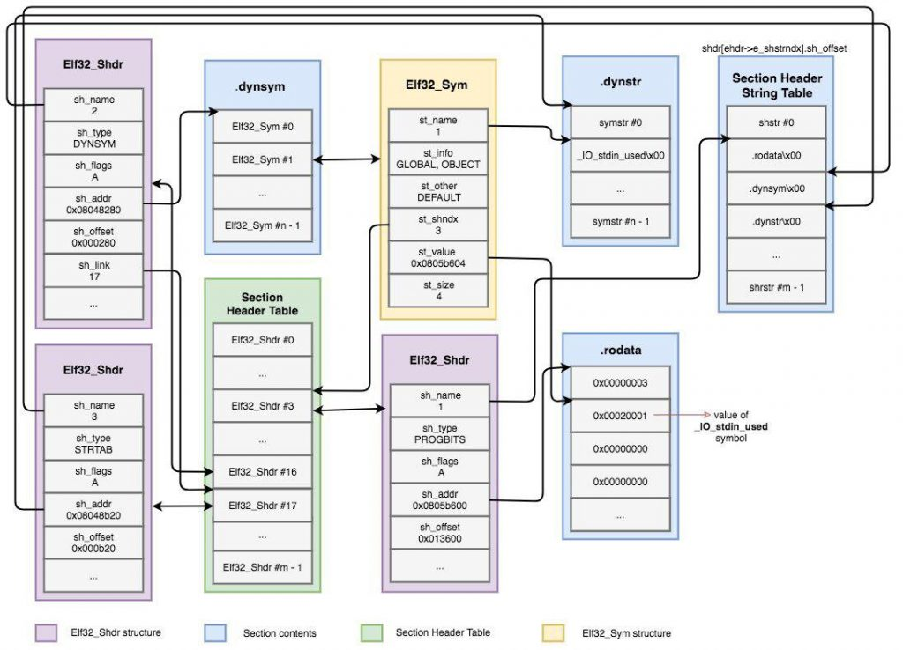

```c
#define ELF32_ST_BIND(val)       (((unsigned char) (val)) >> 4)
#define ELF32_ST_TYPE(val)       ((val) & 0xf)
#define ELF32_ST_INFO(bind,type) (((bind) << 4) + ((type) & 0xf))
#define ELF64_ST_BIND(val)       ELF32_ST_BIND (val)
#define ELF64_ST_TYPE(val)       ELF32_ST_TYPE (val)
#define ELF64_ST_INFO(bind,type) ELF32_ST_INFO ((bind), (type))
```

```c
#define STB_LOCAL      0  /* Local symbol */
#define STB_GLOBAL     1  /* Global symbol */
#define STB_WEAK       2  /* Weak symbol */
#define STB_GNU_UNIQUE 10 /* Unique symbol */
```

```c
#define STT_NOTYPE  0  /* Symbol type is unspecified */
#define STT_OBJECT  1  /* Symbol is a data object */
#define STT_FUNC    2  /* Symbol is a code object */
#define STT_SECTION 3  /* Symbol associated with a section */
#define STT_FILE    4  /* Symbol's name is file name */
#define STT_COMMON  5  /* Symbol is a common data object */
#define STT_TLS     6  /* Symbol is thread-local data object */
#define STT_GNU_IFUNC 10 /* Symbol is indirect code object */
```

---

## Dynamic Linking

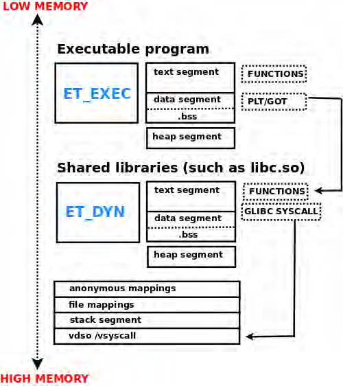

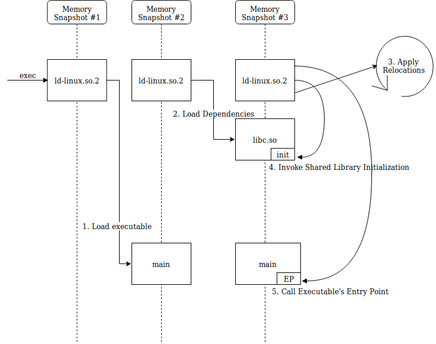

**Dynamic linking** là quá trình resolve functions từ external libraries, tức shared objects.

Mặc định, **lazy binding** được dùng. Nghĩa là function chỉ được resolve tại thời điểm nó được gọi lần đầu. Ở các lần gọi sau, địa chỉ đã resolve sẽ được lưu trong **GOT** (**Global Offset Table**). Khi đó entry trong **PLT** chỉ cần `jmp` tới địa chỉ nằm trong GOT entry của function đó.

Có thể tránh lazy binding bằng biến môi trường `LD_BIND_NOW`, hoặc dùng `RELRO` / `Relocation Read-Only`.

Khi một external function được gọi từ code, thay vì gọi real function trực tiếp, chương trình gọi PLT entry của function đó.

**PLT** là code dùng **GOT** để jump và resolve external functions với sự hỗ trợ của linker.

Ví dụ relocation cần cho `fgets`, được linker resolve. Địa chỉ đã resolve phải được ghi vào đâu đó; trong ví dụ, offset trỏ tới GOT entry của `fgets()`.

```text
Offset       Info        Type              SymValue     SymName
...
0804a000    00000107    R_386_JUMP_SLOT   00000000     fgets
...
```

`0x0804a000` là GOT entry của `fgets()`.

Khi một function như `fgets` được gọi lần đầu:

```asm
objdump -d ./prog
...
8048481: e8 da fe ff ff    call 0x8048360 <fgets@plt>
...
```

`fgets@plt` được gọi.

PLT entry:

```asm
...
08048360 <fgets@plt>:
/* A jmp into the GOT */
8048360:  ff 25 00 a0 04 08   jmp *0x804a000
8048366:  68 00 00 00 00      push $0x0
804836b:  e9 e0 ff ff ff      jmp  0x8048350 <_init+0x34>
...
```

Instruction đầu tiên thực hiện indirect jump tới địa chỉ nằm trong GOT entry của `fgets`.

Ở thời điểm đó, địa chỉ trong GOT chính là instruction kế tiếp của `jmp`, nên instruction `push 0x0` được thực thi. Nó push vào stack index trong GOT nơi `fgets` nằm. Cần lưu ý 3 entry đầu tiên được reserved, nên thực tế nó là entry thứ 4.

### Reserved GOT entries

- `GOT[0]`: Chứa địa chỉ trỏ tới dynamic segment của executable. Dynamic linker dùng nó để trích xuất thông tin liên quan dynamic linking.
- `GOT[1]`: Chứa địa chỉ của struct `link_map`, được dynamic linker dùng để resolve symbols.
- `GOT[2]`: Chứa địa chỉ tới function `_dl_runtime_resolve()` của dynamic linker, dùng để resolve địa chỉ symbol thực tế của shared library function.

Instruction cuối cùng trong PLT stub của `fgets()` là `jmp 0x8048350`. Địa chỉ này trỏ tới PLT entry đầu tiên trong mọi executable, gọi là **PLT-0**.

```asm
8048350: ff 35 f8 9f 04 08      pushl  0x8049ff8
8048356: ff 25 fc 9f 04 08      jmp   *0x8049ffc
804835c: 00 00                  add    %al,(%eax)
```

Instruction `pushl` đầu tiên push địa chỉ của GOT entry thứ hai, `GOT[1]`, lên stack. Như đã nói, `GOT[1]` chứa địa chỉ struct `link_map`.

`jmp *0x8049ffc` thực hiện indirect jump vào GOT entry thứ ba, `GOT[2]`, chứa địa chỉ `_dl_runtime_resolve()`. Điều này chuyển control tới dynamic linker để resolve địa chỉ của `fgets()`. Sau khi `fgets()` được resolve, các lần gọi sau tới PLT entry của `fgets()` sẽ jump trực tiếp tới code của `fgets()`, thay vì quay lại PLT và đi qua lazy linking lần nữa.

### Static Linking

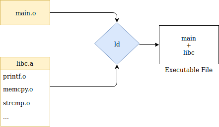

### Dynamic Linking

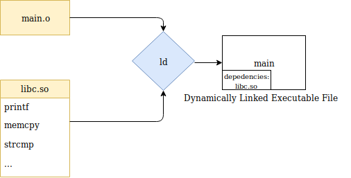

---

## Dynamic

### 32-bit struct

```c
typedef struct
{
  Elf32_Sword d_tag; /* Dynamic entry type */
  union
  {
    Elf32_Word d_val; /* Integer value */
    Elf32_Addr d_ptr; /* Address value */
  } d_un;
} Elf32_Dyn;
```

### 64-bit struct

```c
typedef struct
{
  Elf64_Sxword d_tag; /* Dynamic entry type */
  union
  {
    Elf64_Xword d_val; /* Integer value */
    Elf64_Addr  d_ptr; /* Address value */
  } d_un;
} Elf64_Dyn;
```

### Giá trị

- `d_tag`: Chứa tag.
  - `DT_NEEDED`: Giữ offset vào string table tới tên shared library cần thiết.
  - `DT_SYMTAB`: Chứa địa chỉ dynamic symbol table, còn được biết qua section name `.dynsym`.
  - `DT_HASH`: Chứa địa chỉ symbol hash table, còn được biết qua section name `.hash`, hoặc đôi khi `.gnu.hash`.
  - `DT_STRTAB`: Chứa địa chỉ symbol string table, còn được biết qua section name `.dynstr`.
  - `DT_PLTGOT`: Chứa địa chỉ Global Offset Table.
- `d_val`: Chứa integer value, có thể có nhiều ý nghĩa khác nhau, ví dụ kích thước của relocation entry.
- `d_ptr`: Chứa virtual memory address, có thể trỏ tới nhiều vị trí linker cần. Ví dụ địa chỉ symbol table cho tag `DT_SYMTAB`.

### `d_tag` defines

```c
#define DT_NULL         0   /* Marks end of dynamic section */
#define DT_NEEDED       1   /* Name of needed library */
#define DT_PLTRELSZ     2   /* Size in bytes of PLT relocs */
#define DT_PLTGOT       3   /* Processor defined value */
#define DT_HASH         4   /* Address of symbol hash table */
#define DT_STRTAB       5   /* Address of string table */
#define DT_SYMTAB       6   /* Address of symbol table */
#define DT_RELA         7   /* Address of Rela relocs */
#define DT_RELASZ       8   /* Total size of Rela relocs */
#define DT_RELAENT      9   /* Size of one Rela reloc */
#define DT_STRSZ        10  /* Size of string table */
#define DT_SYMENT       11  /* Size of one symbol table entry */
#define DT_INIT         12  /* Address of init function */
#define DT_FINI         13  /* Address of termination function */
#define DT_SONAME       14  /* Name of shared object */
#define DT_RPATH        15  /* Library search path (deprecated) */
#define DT_SYMBOLIC     16  /* Start symbol search here */
#define DT_REL          17  /* Address of Rel relocs */
#define DT_RELSZ        18  /* Total size of Rel relocs */
#define DT_RELENT       19  /* Size of one Rel reloc */
#define DT_PLTREL       20  /* Type of reloc in PLT */
#define DT_DEBUG        21  /* For debugging; unspecified */
#define DT_TEXTREL      22  /* Reloc might modify .text */
#define DT_JMPREL       23  /* Address of PLT relocs */
#define DT_BIND_NOW     24  /* Process relocations of object */
#define DT_INIT_ARRAY   25  /* Array with addresses of init function */
#define DT_FINI_ARRAY   26  /* Array with addresses of fini function */
#define DT_INIT_ARRAYSZ 27  /* Size in bytes of DT_INIT_ARRAY */
#define DT_FINI_ARRAYSZ 28  /* Size in bytes of DT_FINI_ARRAY */
#define DT_RUNPATH      29  /* Library search path */
#define DT_FLAGS        30  /* Flags for the object being loaded */
#define DT_ENCODING     32  /* Start of encoded range */
#define DT_PREINIT_ARRAY   32 /* Array with addresses of preinit function */
#define DT_PREINIT_ARRAYSZ 33 /* Size in bytes of DT_PREINIT_ARRAY */
#define DT_SYMTAB_SHNDX    34 /* Address of SYMTAB_SHNDX section */
#define DT_NUM          35  /* Number used */
#define DT_LOOS         0x6000000d /* Start of OS-specific */
#define DT_HIOS         0x6ffff000 /* End of OS-specific */
#define DT_LOPROC       0x70000000 /* Start of processor-specific */
#define DT_HIPROC       0x7fffffff /* End of processor-specific */
```

---

## Relocation

**Relocation** là quá trình kết nối symbolic references với symbolic definitions. Relocatable files phải chứa thông tin mô tả cách sửa nội dung section của chúng, từ đó giúp executable và shared object files có đúng thông tin cho program image của process. Các dữ liệu này gọi là **relocation entries**.

### `Rel` 32-bit struct

```c
typedef struct
{
  Elf32_Addr r_offset; /* Address */
  Elf32_Word r_info;   /* Relocation type and symbol index */
} Elf32_Rel;
```

### `Rel` 64-bit struct

```c
typedef struct
{
  Elf64_Addr  r_offset; /* Address */
  Elf64_Xword r_info;   /* Relocation type and symbol index */
} Elf64_Rel;
```

### `Rela` 32-bit struct

```c
typedef struct
{
  Elf32_Addr  r_offset; /* Address */
  Elf32_Word  r_info;   /* Relocation type and symbol index */
  Elf32_Sword r_addend; /* Addend */
} Elf32_Rela;
```

### `Rela` 64-bit struct

```c
typedef struct
{
  Elf64_Addr   r_offset; /* Address */
  Elf64_Xword  r_info;   /* Relocation type and symbol index */
  Elf64_Sxword r_addend; /* Addend */
} Elf64_Rela;
```

### Giá trị

- `r_offset`: Trỏ tới vị trí cần relocation action.
  - Với binary type `ET_REL`, giá trị này biểu diễn offset trong section header nơi relocation phải diễn ra.
  - Với binary type `ET_EXEC`, giá trị này biểu diễn virtual address bị ảnh hưởng bởi relocation.
- `r_info`: Cung cấp cả index vào symbol table liên quan relocation và type relocation cần áp dụng.
- `r_addend`: Chỉ định constant addend dùng để tính giá trị lưu vào relocatable field.

### x86 Relocation types

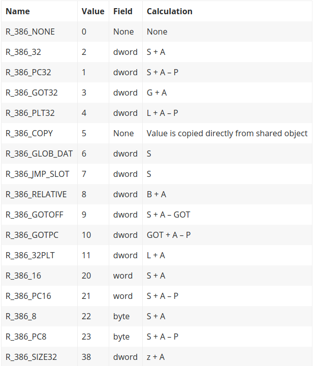

### x86_64 Relocation types

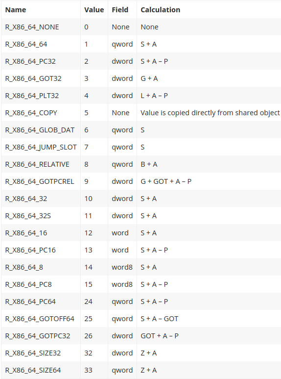

### Giá trị ký hiệu trong relocation

- `A`: Addend dùng để tính giá trị của relocatable field.
- `B`: Base address nơi shared object được load vào memory khi execution. Thường shared object file được build với base virtual address bằng 0, nhưng execution address sẽ khác.
- `G`: Offset trong Global Offset Table nơi địa chỉ symbol của relocation entry sẽ nằm khi execution.
- `GOT`: Địa chỉ của Global Offset Table.
- `L`: Vị trí, tức section offset hoặc address, của Procedure Linkage Table entry cho một symbol. PLT entry redirect function call tới đúng destination.
- `P`: Vị trí, tức section offset hoặc address, của storage unit đang được relocate, tính bằng `r_offset`.
- `S`: Giá trị của symbol có index nằm trong relocation entry.

### Generic relocation suffixes

- `_NONE`: Entry bị bỏ qua.
- `_64`: Giá trị relocation dạng qword.
- `_32`: Giá trị relocation dạng dword.
- `_16`: Giá trị relocation dạng word.
- `_8`: Giá trị relocation dạng byte.
- `_PC`: Relative to program counter.
- `_GOT`: Relative to GOT.
- `_PLT`: Relative to PLT.
- `_COPY`: Giá trị được copy trực tiếp từ shared object tại load-time.
- `_GLOB_DAT`: Global variable.
- `_JMP_SLOT`: PLT entry.
- `_RELATIVE`: Relative to image base của program image.
- `_GOTOFF`: Absolute address trong GOT.
- `_GOTPC`: Program-counter-relative GOT offset.

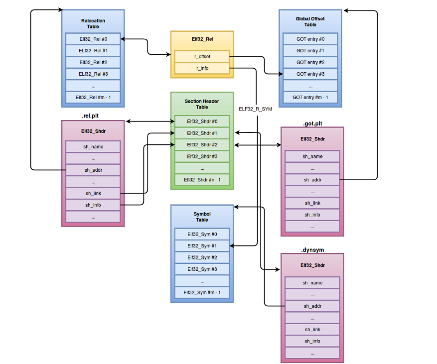

### Sections liên quan relocation

- `.rel.bss`: Chứa toàn bộ `R_386_COPY` relocs.
- `.rel.plt`: Chứa toàn bộ `R_386_JMP_SLOT` relocs; các relocation này sửa nửa đầu của GOT elements.
- `.rel.got`: Chứa toàn bộ `R_386_GLOB_DATA` relocs; các relocation này sửa nửa sau của GOT elements.
- `.rel.data`: Chứa `R_386_32` và `R_386_RELATIVE` relocs.
- `.rela.dyn`: Chứa dynamic relocations cho variables.
- `.rela.plt`: Chứa dynamic relocations cho functions.

---

## Stripped binaries

**Stripped binaries** là binary đã bị loại bỏ symbols.

Nhìn chung, loader không cần symbols để load một ELF executable, ngoại trừ các symbols phục vụ dynamic linking.

Symbols thường được dùng cho debugging, và giúp reverse engineering dễ hơn vì chúng cung cấp function names và nhiều thông tin về cấu trúc ELF file.

Tuy nhiên, vì dynamic symbols vẫn còn, ta vẫn có thể xem imported functions từ external libraries như `glibc`.

---

## Differences between 32-bit and 64-bit ELF objects

Khác biệt chính:

- Trong ELF header, `e_machine` thay đổi.
- Kích thước của các giá trị trong ELF file cũng thay đổi.

---

## Sections VS Segments

Segments được chia thành sections; mỗi section có một công dụng đối với ELF file.

Bản thân sections không hữu ích tại runtime, nên chúng chủ yếu hữu ích tại link time.

Segments được dùng để tạo một block memory với permissions cụ thể và lưu nội dung vào đó.

Khác với một số file format khác, ELF files gồm cả sections và segments. Như đã nói, sections gom các thông tin cần thiết để link object file và build executable. Trong khi đó, Program Headers chia executable thành các segments với attributes khác nhau, cuối cùng sẽ được load vào memory.

Để hiểu quan hệ giữa sections và segments, có thể xem segments như công cụ giúp Linux loader “đỡ khổ” hơn. Segments gom các sections theo attributes vào một segment duy nhất, giúp quá trình loading của executable hiệu quả hơn, thay vì load từng section riêng lẻ vào memory.

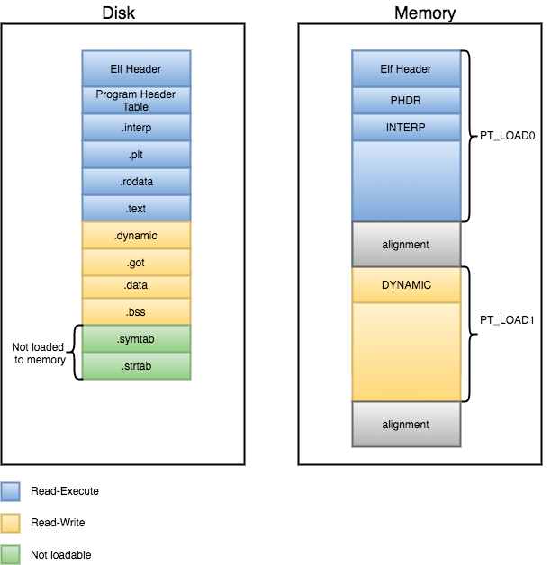

---

## In-memory loaded ELF VS ELF file

ELF files trên disk chỉ là một format mô tả cách load file đó vào memory sao cho chạy đúng.

Trên disk, nó chỉ định một số thông tin không thật sự cần thiết ở runtime, ví dụ `.symtab`, `.strtab`; các section này không được dùng runtime và chủ yếu phục vụ debugging.

Kích thước trong memory thường khác kích thước trên disk. Ví dụ, nếu program định nghĩa uninitialized variables trong `.bss`, trên disk chỉ cần chỉ định kích thước mà không cần chiếm đúng dung lượng đó. Khi load vào memory, loader phải cấp phát không gian đó, thường fill bằng zero. Do đó dung lượng cần cấp phát trong memory tăng lên.

Tổng quan cơ bản:

- ELF file trên disk:

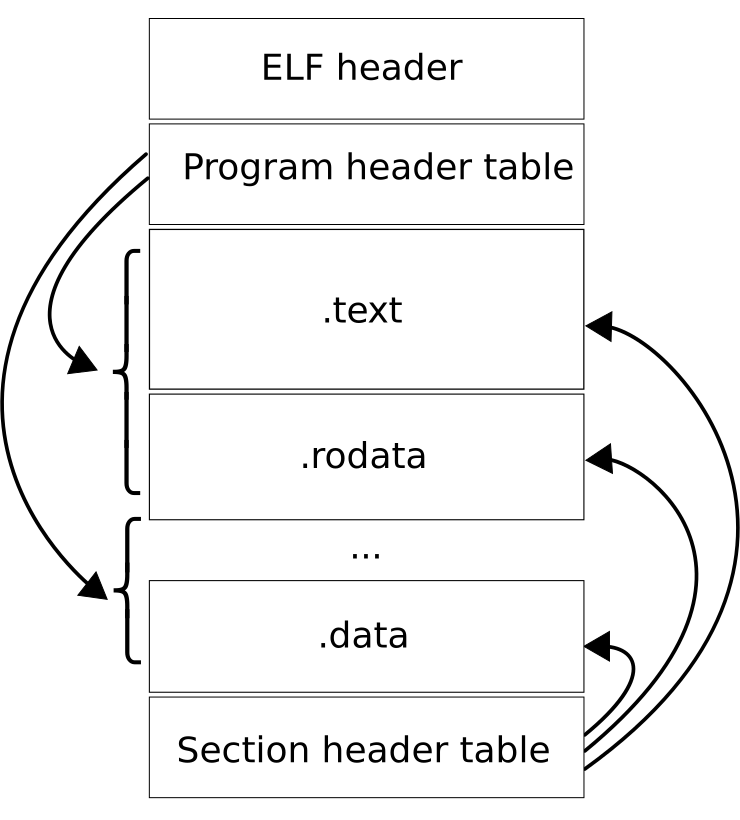

- ELF loaded in memory:

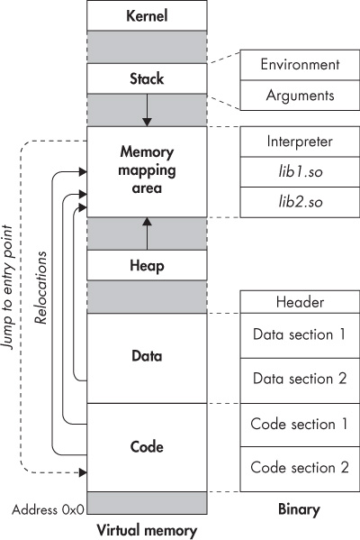
- ELF loaded in memory — xem hình trong Gist gốc.

---

## Differences between ELF objects

### Object Files

Object files là relocatable files. Chúng được dùng để link với các object files khác.

Chúng cung cấp thông tin cho linker để khi đến lúc link với các object files còn lại, linker có thể relocation và xử lý dễ hơn.

Nội dung object file khác với các ELF files khác như `ET_EXEC` và `ET_DYN`.

Object file thường có các section `.rela.text` và `.rela.eh_frame`.

Vì đây chưa phải một ELF hoàn chỉnh, chưa có các section cụ thể được tạo đầy đủ. Do đó ta thường chỉ thấy các section code/data thông thường và symbols.

### Statically-linked executable files

Executable files loại này không phụ thuộc external libraries, nên không nên còn relocations pending vì chúng có thể load mà không cần external objects.

Chúng không cần `.dynamic` hoặc Dynamic segment. Chúng không cần GOT hoặc PLT vì function calls được thực hiện trực tiếp tới địa chỉ function, không qua trung gian.

Trong loại ELF này, ta thường thấy các section code/data thông thường và symbols, nhưng symbols có thể bị remove.

Vì static, nếu dùng libc functions thì tổng kích thước file sẽ khá lớn.

### Dynamically-linked executable files

Chúng vẫn là executable, nhưng vì được dynamically linked nên chúng là PIC (**Position Independent Code**).

Chúng cần GOT và PLT làm trung gian để dùng external functions từ shared libraries như `printf()`.

Trong loại executable này, ta thường thấy các section code/data thông thường, GOT, PLT, các dynamic-linking symbol sections như `.dynsym` và `.dynstr`, cũng như static symbols không thật sự cần thiết.

Ta cũng thấy section `.dynamic`, rất quan trọng cho dynamic linking, và các section `.rela.dyn`, `.rela.plt`.

### Shared libraries

Shared libraries được load vào memory của process để cung cấp functions cho executable sử dụng chúng.

Chúng giống dynamically-linked executables nhưng không hoàn toàn giống.

Ở đây không có segment `PT_INTERP`, vì shared library không được kernel load mà được linker load.

Ngoài ra, local functions cũng được đưa vào `.dynsym`, không chỉ `.symtab`, và `__libc_start_main` không được import.

Cấu trúc còn lại phần lớn giống dynamically-linked executables.

---

## Step-by-step ELF loading for each object type, ASLR and PIC/PIE

### Relocatable files

Chúng không được kỳ vọng sẽ được load trực tiếp, vì còn relocations pending cần xử lý để tạo executable hoạt động hoàn chỉnh trước.

### Statically-linked executable files

Đầu tiên, khi ta chạy một executable, kernel thiết lập một process, cấp cho nó virtual memory space, stack, v.v.

Stack cho address space của process được setup theo một cách rất cụ thể để truyền thông tin cho dynamic linker. Cách sắp xếp thông tin này gọi là **auxiliary vector** hoặc **auxv**.

> Hình minh họa: Auxiliary vector — xem trong Gist gốc.

```c
typedef struct
{
    uint64_t a_type;
    union
    {
        uint64_t a_val;
    } a_un;
} Elf64_auxv_t;
```

```c
/* Legal values for a_type (entry type). */
#define AT_NULL         0  /* End of vector */
#define AT_IGNORE       1  /* Entry should be ignored */
#define AT_EXECFD       2  /* File descriptor of program */
#define AT_PHDR         3  /* Program headers for program */
#define AT_PHENT        4  /* Size of program header entry */
#define AT_PHNUM        5  /* Number of program headers */
#define AT_PAGESZ       6  /* System page size */
#define AT_BASE         7  /* Base address of interpreter */
#define AT_FLAGS        8  /* Flags */
#define AT_ENTRY        9  /* Entry point of program */
#define AT_NOTELF       10 /* Program is not ELF */
#define AT_UID          11 /* Real uid */
#define AT_EUID         12 /* Effective uid */
#define AT_GID          13 /* Real gid */
#define AT_EGID         14 /* Effective gid */
#define AT_CLKTCK       17 /* Frequency of times() */
#define AT_SYSINFO      32
#define AT_SYSINFO_EHDR 33
```

Auxiliary vector là cấu trúc đặc biệt để truyền thông tin trực tiếp từ kernel tới program mới chạy. Nó chứa thông tin phụ thuộc hệ thống, ví dụ page size mặc định của virtual memory hoặc hardware capabilities.

Sau đó operating system map interpreter vào virtual memory của process, thường là `ld-linux.so`. Nó đọc interpreter code và bắt đầu chạy từ entry point của interpreter. Có thể lấy interpreter từ section `.interp` trong ELF file.

Interpreter load binary và chuyển control tới entry point của binary.

Tóm tắt:

- Kernel map program vào memory, kèm vDSO.
- Kernel setup stack và registers, truyền arguments và environment variables, rồi gọi main program entry point.
- Executable được load tại fixed address và không cần relocation.

### Dynamically-linked executable files

Đầu tiên, khi ta chạy executable, kernel thiết lập process, cấp virtual memory space, stack, v.v.

Stack của process address space được setup theo cách rất cụ thể để truyền thông tin cho dynamic linker. Cách setup này gọi là **auxiliary vector** hoặc **auxv**.

Auxiliary vector:

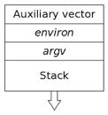

Stack init:

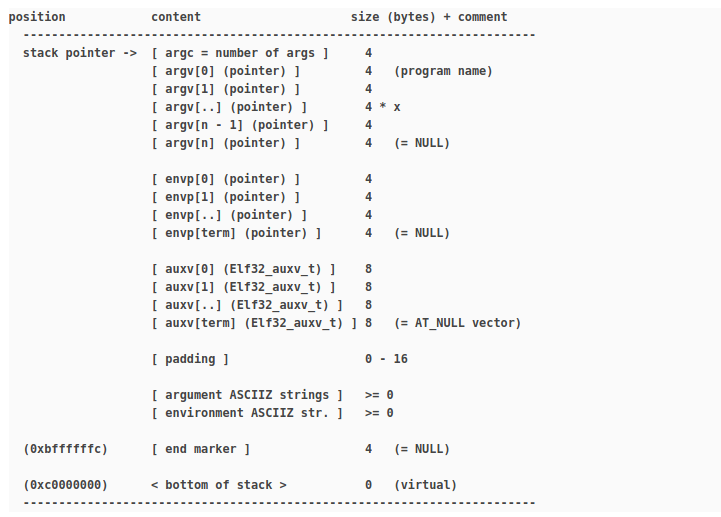

Sample view:

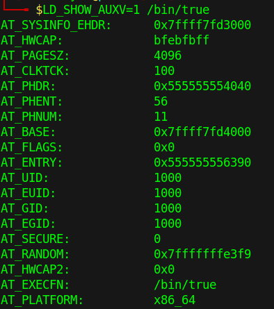

Struct và auxv type giống phần trên.

Sau khi program code được load vào memory, ELF handler cũng load ELF interpreter program vào memory bằng `load_elf_interp()`. Quá trình này tương tự khi load program gốc: kiểm tra thông tin format trong ELF header, đọc program header, map tất cả `PT_LOAD` segments từ file vào memory của program mới, và chừa chỗ cho `BSS` segment của interpreter.

Interpreter có thể được lấy từ section `.interp` trong ELF file.

Execution start address của program cũng được set thành entry point của interpreter thay vì entry point của program. Khi system call `execve()` hoàn tất, execution bắt đầu ở ELF interpreter. Interpreter xử lý linkage requirements của program từ user space: tìm và load shared libraries mà program phụ thuộc, rồi resolve undefined symbols của program tới definitions đúng trong các libraries đó.

Khi quá trình linkage xong, interpreter có thể bắt đầu execution của program mới tại địa chỉ được lưu trong auxiliary value `AT_ENTRY`.

System calls chậm, nên các hệ thống hiện đại có cơ chế tránh overhead khi trap vào processor.

Trong Linux, điều này được triển khai bằng một “mẹo” giữa dynamic loader và kernel, giao tiếp qua `AUXV`. Kernel thêm một shared library nhỏ vào address space của mọi process mới tạo. Library này chứa function thực hiện system calls. Nếu hardware hỗ trợ fast syscall, kernel có thể dùng cơ chế đó; nếu không, nó dùng cơ chế cũ là tạo trap.

Library này tên là `linux-gate.so.1`, vì nó giống một gateway vào phần bên trong kernel.

Khi kernel khởi động dynamic linker, nó thêm một entry vào auxv tên là `AT_SYSINFO_EHDR`, chứa địa chỉ trong memory nơi special kernel library nằm. Khi dynamic linker bắt đầu, nó tìm pointer `AT_SYSINFO_EHDR`; nếu có, nó load library đó cho program. Program không biết library này tồn tại; đây là cơ chế riêng giữa dynamic linker và kernel.

Interpreter load binary, parse nó để biết binary cần libraries nào, map chúng bằng `mmap` hoặc cơ chế tương tự, rồi thực hiện các relocation cuối cùng cần thiết trong code sections của binary để điền đúng địa chỉ cho references tới dynamic libraries.

Dynamic linker sẽ jump tới entry point address được cung cấp trong ELF binary.

Entry point là function `_start` trong binary. Tại đây, nếu disassemble, ta thấy một số giá trị được push lên stack. Giá trị đầu tiên là địa chỉ function `__libc_csu_fini`, một giá trị khác là `__libc_csu_init`, và cuối cùng là địa chỉ function `main()`. Sau đó function `__libc_start_main` được gọi.

Ở giai đoạn này, `__libc_start_main` nhận khá nhiều input parameters trên stack: program arguments, environment variables, auxiliary vector từ kernel, cùng các địa chỉ function để xử lý `init`, `fini`, và địa chỉ của `main()`.

Giá trị cuối cùng push lên stack cho `__libc_start_main` là initialization function `__libc_csu_init`. Nếu theo call chain từ `__libc_csu_init`, ta thấy nó setup một số thứ rồi gọi function `_init` trong executable. `_init` cuối cùng gọi một số function như `__do_global_ctors_aux`, `frame_dummy`, `call_gmon_start`.

Khi `__libc_start_main` hoàn tất lời gọi `_init`, nó gọi `main()`. Stack đã được setup với arguments và environment pointers từ kernel, nên `main` có `argc`, `argv[]`, `envp[]`. Process bắt đầu chạy và setup phase hoàn tất.

Cuối cùng, các end functions được gọi và `exit()` được gọi với return value từ `main()`.

Công việc tiếp theo của linker là lazy-binding các library functions khi chúng được gọi. Bằng cách dùng symbols của library, dynamic symbols từ executable và relocations cho GOT, dynamic linking được thực hiện thành công.

Tóm tắt:

- Locate và map toàn bộ dependencies, bao gồm shared object được chỉ định trong `LD_PRELOAD`.
- Relocate các files.

Tổng quan mức cao:

- Kernel khởi tạo process:
  - Map main program, interpreter/dynamic linker segments và vDSO vào virtual address space.
  - Setup stack, truyền arguments/environment, rồi gọi dynamic linker entry point.
- Dynamic linker load các ELF objects khác nhau và bind chúng lại:
  - Relocate chính nó.
  - Tìm và load các libraries cần thiết.
  - Thực hiện relocations để bind các ELF objects.
  - Gọi initialization functions của shared objects.
- Các function này được chỉ định trong `DT_INIT` và `DT_INIT_ARRAY` entries của ELF objects.
- Gọi entry point của main program.
- Entry point của main program nằm trong entry `AT_ENTRY` của auxiliary vector, được kernel khởi tạo từ field `e_entry` trong ELF header.
- Executable sau đó tự initialize chính nó.

### Shared libraries

Như đã giải thích, shared libraries được load vào process memory space, và linker thực hiện dynamic-linking work.

---

## Common objects and functions

- `frame_dummy`: Function này nằm trong section `.init`. Nó được định nghĩa là `void frame_dummy(void)` và mục đích chính là gọi `__register_frame_info_bases`.
- `_start`: Nơi `e_entry` trỏ tới; đây là code đầu tiên được execute.
- `_init`: Dynamic loader execute function `(INIT)` trước khi control được chuyển tới `_start`, và execute `(FINI)` ngay trước khi control được trả về OS kernel. `_init` là function mặc định dùng cho tag `(INIT)`. Nó gọi một số function như `__gmon_start__`, `frame_dummy`, `__do_global_ctors_aux`.
- `_fini`: Dynamic loader execute `(FINI)` ngay trước khi control được trả về OS kernel.
- `.init`: Code chạy khi program bắt đầu.
- `.fini`: Code chạy khi program kết thúc.
- `.init_array`: Mảng pointers dùng làm constructors.
- `.fini_array`: Mảng pointers dùng làm destructors.
- `__libc_start_main`: Function của libc setup một số thứ và gọi `main()`.
- `deregister_tm_clones`: Transactional memory giúp lập trình với threads đơn giản hơn, là lựa chọn thay thế lock-based synchronization. Routine này tear down một table do library `libitm` dùng.
- `register_tm_clones`: Routine setup table dùng bởi `libitm` cho transactional memory.
- `__register_frame_info_bases`: Function liên quan frame/unwind metadata.
- `__stack_chk_fail`: Function của Stack Smashing Protector.
- `__do_global_dtors_aux`: Chạy toàn bộ global destructors khi program exit trên hệ thống không có `.fini_array`.
- `__do_global_dtors_aux_fini_array_entry` và `__init_array_end`: Đánh dấu end/start của section `.fini_array`, chứa pointers tới program-level finalizers.
- `__frame_dummy_init_array_entry` và `__init_array_start`: Đánh dấu end/start của section `.init_array`, chứa pointers tới program-level initializers.
- `__libc_csu_init`: Chạy program-level initializers, gần giống constructors cho toàn bộ program.
- `__libc_csu_fini`: Chạy program-level finalizers, gần giống destructors cho toàn bộ program.
- `main`: Với programs linked với libc, đây là function user-custom đầu tiên được gọi bởi `__libc_start_main`.
- `.eh_frame`: Tính năng debugging dựa trên DWARF, ví dụ stack unwinding.

Tóm tắt:

- `_start` gọi libc `__libc_start_main`.
- `__libc_start_main` gọi executable `__libc_csu_init`, là phần statically-linked của libc.
- `__libc_csu_init` gọi constructors của executable và các initialization khác.
- `__libc_start_main` gọi executable `main()`.
- `__libc_start_main` gọi executable `exit()`.

> Hình minh họa: Diagram — xem trong Gist gốc.

---

## FAQ — Frequently Asked Questions

### Why do we need sections?

Sections tồn tại chủ yếu để giúp linker làm việc dễ hơn. Ví dụ, khi cần chỉ định relocation cho file `ET_REL`, ta chỉ định offset bên trong section đó.

### How does the compiler make dynamically-linked executables (`DT_NEEDED`)?

Khi compiler compile một dynamically-linked executable, thay vì compile nó thành library `.a` và link statically, nó tạo trong section `.dynamic` một string với tên library, được chỉ định bởi `DT_NEEDED`. Ví dụ: `libc.so.6`.

Khi binary được execute trên một hệ thống khác, interpreter tìm library đó theo tên và load nó vào memory để bắt đầu dynamic-linking process.

### When using PIC/PIE executables, how do the addresses get patched so the offset is added?

-- TO DO --

### What is the difference between `.got`, `.plt.got`, `.plt` and `.got.plt`?

`.got` dùng cho relocations liên quan global variables, trong khi `.got.plt` là section phụ trợ hoạt động cùng `.plt` khi resolve absolute addresses của procedures.

### Where is mmap space located?

-- TO DO --

### Where is ld loaded?

-- TO DO --

### Where are needed libraries loaded?

-- TO DO --

### What is the difference between `Rel` and `Rela`?

`Rel` được dùng trong hệ thống 32-bit, còn `Rela` được dùng trong hệ thống 64-bit.

`Rela` có addend, còn `Rel` thì không.

### How is process address selected?

-- TO DO --

### How does alignment work?

-- TO DO --

### How are other segments included in `PT_LOAD` ones?

-- TO DO --

### What happens if we include more than one shared-library?

-- TO DO --

### What happens if A (program) which uses libc, imports also B (library) which also uses libc?

-- TO DO --

### When `a()` local calls `b()` libc and `b()` calls `c()` libc too, is `c()` imported in `.dynsym`?

-- TO DO --

---

---

## Danh sách ảnh gốc / local path

Bản này đã nhúng đủ các ảnh xuất hiện trong nội dung chính của Gist gốc:

1. ELF — `images/01_elf_overview.png` — nguồn: `https://i.imgur.com/Ai9OqOB.png`
2. Compilation — `images/02_compilation_pipeline.png` — nguồn: `https://i.imgur.com/LNddTmk.png`
3. Static Linking — `images/06_static_linking.png` — nguồn: `https://i.imgur.com/g8CQKHm.png`
4. Dynamic Linking — `images/07_dynamic_linking_static_vs_dynamic.png` — nguồn: `https://i.imgur.com/SSBTMS3.png`
5. x86_RELOCATIONS — `images/08_x86_relocations.png` — nguồn: `https://i.imgur.com/jJi1BDG.png`
6. x86_64_RELOCATIONS — `images/09_x86_64_relocations.png` — nguồn: `https://i.imgur.com/0xCx0Ap.png`
7. Relocation Image — `images/10_relocation_image.png` — nguồn: `https://i.imgur.com/jkKNuhL.png`
8. Segments and Sections — `images/11_segments_and_sections.png` — nguồn: `https://i.imgur.com/j6K9ycH.png`
9. ELF file on disk — `images/12_elf_file_on_disk.png` — nguồn: `https://i.imgur.com/qPYlh7B.png`
10. In-memory ELF — `images/13_in_memory_elf.png` — nguồn: `https://i.imgur.com/sGtvRnH.png`
11. Auxiliary vector — `images/14_auxiliary_vector.png` — nguồn: `https://i.imgur.com/sRZkt21.png`
12. Stack init — `images/15_stack_init.png` — nguồn: `https://i.imgur.com/Zy6Js20.png`
13. Sample view — `images/16_sample_view.png` — nguồn: `https://i.imgur.com/DHxTr7n.png`

> Lưu ý: ảnh được nhúng bằng URL online gốc để khi upload lên GitHub/Gist thì Markdown render được trực tiếp.

## References

- *Practical Linux Binary Analysis: Build Your Own Linux Tools for Binary Instrumentation, Analysis, and Disassembly* — Dennis Andriesse.
- *Learning Linux Binary Analysis* — Ryan “elfmaster” O’Neill.
- System V ABI / ELF specification.
- Hydrasky: ELF relocation and dynamic linking.
- Intezer: Executable and Linkable Format 101 — sections & segments.
- `ld.so(8)` man pages.
- GCC documentation: Initialization.
- GCC wiki: Transactional Memory.
- GCC `crtstuff.c`.
- Bottom Up CS: Starting a process.
- Gabriel Urdhr: ELF linking.
- Linux program startup debugging notes.
- `/usr/include/elf.h`.
- `ELF(5)` man pages.

---

## Ghi chú thêm về bản dịch

Một số phần trong Gist gốc là hình minh họa. Trong bản `.md` này, mình giữ lại vị trí hình dưới dạng ghi chú “xem trong Gist gốc”, vì nội dung chính cần dịch là phần text/struct/macro. Các block code, tên macro, tên section và tên symbol được giữ nguyên để bạn có thể dùng trực tiếp khi học reverse engineering, binary analysis hoặc đọc `readelf`/`objdump`.

---

## Phụ lục: `e_machine` defines đầy đủ hơn từ Gist gốc

> Phần này giữ nguyên tên kiến trúc và comment tiếng Anh vì đây là macro/reference kỹ thuật trong `elf.h`.

```c
#define EM_NONE          0   /* No machine */
#define EM_M32           1   /* AT&T WE 32100 */
#define EM_SPARC         2   /* SUN SPARC */
#define EM_386           3   /* Intel 80386 */
#define EM_68K           4   /* Motorola m68k family */
#define EM_88K           5   /* Motorola m88k family */
#define EM_IAMCU         6   /* Intel MCU */
#define EM_860           7   /* Intel 80860 */
#define EM_MIPS          8   /* MIPS R3000 big-endian */
#define EM_S370          9   /* IBM System/370 */
#define EM_MIPS_RS3_LE   10  /* MIPS R3000 little-endian */
#define EM_PARISC        15  /* HPPA */
#define EM_VPP500        17  /* Fujitsu VPP500 */
#define EM_SPARC32PLUS   18  /* Sun's "v8plus" */
#define EM_960           19  /* Intel 80960 */
#define EM_PPC           20  /* PowerPC */
#define EM_PPC64         21  /* PowerPC 64-bit */
#define EM_S390          22  /* IBM S390 */
#define EM_SPU           23  /* IBM SPU/SPC */
#define EM_V800          36  /* NEC V800 series */
#define EM_FR20          37  /* Fujitsu FR20 */
#define EM_RH32          38  /* TRW RH-32 */
#define EM_RCE           39  /* Motorola RCE */
#define EM_ARM           40  /* ARM */
#define EM_FAKE_ALPHA    41  /* Digital Alpha */
#define EM_SH            42  /* Hitachi SH */
#define EM_SPARCV9       43  /* SPARC v9 64-bit */
#define EM_TRICORE       44  /* Siemens Tricore */
#define EM_ARC           45  /* Argonaut RISC Core */
#define EM_H8_300        46  /* Hitachi H8/300 */
#define EM_H8_300H       47  /* Hitachi H8/300H */
#define EM_H8S           48  /* Hitachi H8S */
#define EM_H8_500        49  /* Hitachi H8/500 */
#define EM_IA_64         50  /* Intel Merced */
#define EM_MIPS_X        51  /* Stanford MIPS-X */
#define EM_COLDFIRE      52  /* Motorola Coldfire */
#define EM_68HC12        53  /* Motorola M68HC12 */
#define EM_MMA           54  /* Fujitsu MMA Multimedia Accelerator */
#define EM_PCP           55  /* Siemens PCP */
#define EM_NCPU          56  /* Sony nCPU embedded RISC */
#define EM_NDR1          57  /* Denso NDR1 microprocessor */
#define EM_STARCORE      58  /* Motorola Star*Core processor */
#define EM_ME16          59  /* Toyota ME16 processor */
#define EM_ST100         60  /* STMicroelectronic ST100 processor */
#define EM_TINYJ         61  /* Advanced Logic Corp. Tinyj embedded family */
#define EM_X86_64        62  /* AMD x86-64 architecture */
#define EM_PDSP          63  /* Sony DSP Processor */
#define EM_PDP10         64  /* Digital PDP-10 */
#define EM_PDP11         65  /* Digital PDP-11 */
#define EM_FX66          66  /* Siemens FX66 microcontroller */
#define EM_ST9PLUS       67  /* STMicroelectronics ST9+ 8/16 microcontroller */
#define EM_ST7           68  /* STMicroelectronics ST7 8-bit microcontroller */
#define EM_68HC16        69  /* Motorola MC68HC16 microcontroller */
#define EM_68HC11        70  /* Motorola MC68HC11 microcontroller */
#define EM_68HC08        71  /* Motorola MC68HC08 microcontroller */
#define EM_68HC05        72  /* Motorola MC68HC05 microcontroller */
#define EM_SVX           73  /* Silicon Graphics SVx */
#define EM_ST19          74  /* STMicroelectronics ST19 8-bit microcontroller */
#define EM_VAX           75  /* Digital VAX */
#define EM_CRIS          76  /* Axis Communications 32-bit embedded processor */
#define EM_JAVELIN       77  /* Infineon Technologies 32-bit embedded processor */
#define EM_FIREPATH      78  /* Element 14 64-bit DSP Processor */
#define EM_ZSP           79  /* LSI Logic 16-bit DSP Processor */
#define EM_MMIX          80  /* Donald Knuth's educational 64-bit processor */
#define EM_HUANY         81  /* Harvard University machine-independent object files */
#define EM_PRISM         82  /* SiTera Prism */
#define EM_AVR           83  /* Atmel AVR 8-bit microcontroller */
#define EM_FR30          84  /* Fujitsu FR30 */
#define EM_D10V          85  /* Mitsubishi D10V */
#define EM_D30V          86  /* Mitsubishi D30V */
#define EM_V850          87  /* NEC v850 */
#define EM_M32R          88  /* Mitsubishi M32R */
#define EM_MN10300       89  /* Matsushita MN10300 */
#define EM_MN10200       90  /* Matsushita MN10200 */
#define EM_PJ            91  /* picoJava */
#define EM_OPENRISC      92  /* OpenRISC 32-bit embedded processor */
#define EM_ARC_COMPACT   93  /* ARC International ARCompact */
#define EM_XTENSA        94  /* Tensilica Xtensa Architecture */
#define EM_VIDEOCORE     95  /* Alphamosaic VideoCore */
#define EM_TMM_GPP       96  /* Thompson Multimedia General Purpose Processor */
#define EM_NS32K         97  /* National Semiconductor 32000 */
#define EM_TPC           98  /* Tenor Network TPC */
#define EM_SNP1K         99  /* Trebia SNP 1000 */
#define EM_ST200         100 /* STMicroelectronics ST200 */
#define EM_IP2K          101 /* Ubicom IP2xxx */
#define EM_MAX           102 /* MAX processor */
#define EM_CR            103 /* National Semiconductor CompactRISC */
#define EM_F2MC16        104 /* Fujitsu F2MC16 */
#define EM_MSP430        105 /* Texas Instruments msp430 */
#define EM_BLACKFIN      106 /* Analog Devices Blackfin DSP */
#define EM_SE_C33        107 /* Seiko Epson S1C33 family */
#define EM_SEP           108 /* Sharp embedded microprocessor */
#define EM_ARCA          109 /* Arca RISC */
#define EM_UNICORE       110 /* PKU-Unity & MPRC Peking Uni. mc series */
#define EM_EXCESS        111 /* eXcess configurable CPU */
#define EM_DXP           112 /* Icera Semi. Deep Execution Processor */
#define EM_ALTERA_NIOS2  113 /* Altera Nios II */
#define EM_CRX           114 /* National Semi. CompactRISC CRX */
#define EM_XGATE         115 /* Motorola XGATE */
#define EM_C166          116 /* Infineon C16x/XC16x */
#define EM_M16C          117 /* Renesas M16C */
#define EM_DSPIC30F      118 /* Microchip Technology dsPIC30F */
#define EM_CE            119 /* Freescale Communication Engine RISC */
#define EM_M32C          120 /* Renesas M32C */
#define EM_TSK3000       131 /* Altium TSK3000 */
#define EM_RS08          132 /* Freescale RS08 */
#define EM_SHARC         133 /* Analog Devices SHARC family */
#define EM_ECOG2         134 /* Cyan Technology eCOG2 */
#define EM_SCORE7        135 /* Sunplus S+core7 RISC */
#define EM_DSP24         136 /* New Japan Radio 24-bit DSP */
#define EM_VIDEOCORE3    137 /* Broadcom VideoCore III */
#define EM_LATTICEMICO32 138 /* RISC for Lattice FPGA */
#define EM_SE_C17        139 /* Seiko Epson C17 */
#define EM_TI_C6000      140 /* Texas Instruments TMS320C6000 DSP */
#define EM_TI_C2000      141 /* Texas Instruments TMS320C2000 DSP */
#define EM_TI_C5500      142 /* Texas Instruments TMS320C55x DSP */
#define EM_TI_ARP32      143 /* Texas Instruments Application Specific RISC */
#define EM_TI_PRU        144 /* Texas Instruments Programmable Realtime Unit */
#define EM_MMDSP_PLUS    160 /* STMicroelectronics 64-bit VLIW DSP */
#define EM_CYPRESS_M8C   161 /* Cypress M8C */
#define EM_R32C          162 /* Renesas R32C */
#define EM_TRIMEDIA      163 /* NXP Semi. TriMedia */
#define EM_QDSP6         164 /* QUALCOMM DSP6 */
#define EM_8051          165 /* Intel 8051 and variants */
#define EM_STXP7X        166 /* STMicroelectronics STxP7x */
#define EM_NDS32         167 /* Andes Tech. compact code embedded RISC */
#define EM_ECOG1X        168 /* Cyan Technology eCOG1X */
#define EM_MAXQ30        169 /* Dallas Semi. MAXQ30 microcontroller */
#define EM_XIMO16        170 /* New Japan Radio 16-bit DSP */
#define EM_MANIK         171 /* M2000 Reconfigurable RISC */
#define EM_CRAYNV2       172 /* Cray NV2 vector architecture */
#define EM_RX            173 /* Renesas RX */
#define EM_METAG         174 /* Imagination Tech. META */
#define EM_MCST_ELBRUS   175 /* MCST Elbrus */
#define EM_ECOG16        176 /* Cyan Technology eCOG16 */
#define EM_CR16          177 /* National Semi. CompactRISC CR16 */
#define EM_ETPU          178 /* Freescale Extended Time Processing Unit */
#define EM_SLE9X         179 /* Infineon Tech. SLE9X */
#define EM_L10M          180 /* Intel L10M */
#define EM_K10M          181 /* Intel K10M */
#define EM_AARCH64       183 /* ARM AARCH64 */
#define EM_AVR32         185 /* Atmel 32-bit microprocessor */
#define EM_STM8          186 /* STMicroelectronics STM8 */
#define EM_TILE64        187 /* Tilera TILE64 */
#define EM_TILEPRO       188 /* Tilera TILEPro */
#define EM_MICROBLAZE    189 /* Xilinx MicroBlaze */
#define EM_CUDA          190 /* NVIDIA CUDA */
#define EM_TILEGX        191 /* Tilera TILE-Gx */
#define EM_CLOUDSHIELD   192 /* CloudShield */
#define EM_COREA_1ST     193 /* KIPO-KAIST Core-A 1st gen. */
#define EM_COREA_2ND     194 /* KIPO-KAIST Core-A 2nd gen. */
#define EM_ARC_COMPACT2  195 /* Synopsys ARCompact V2 */
#define EM_OPEN8         196 /* Open8 RISC */
#define EM_RL78          197 /* Renesas RL78 */
#define EM_VIDEOCORE5    198 /* Broadcom VideoCore V */
#define EM_78KOR         199 /* Renesas 78KOR */
#define EM_56800EX       200 /* Freescale 56800EX DSC */
#define EM_BA1           201 /* Beyond BA1 */
#define EM_BA2           202 /* Beyond BA2 */
#define EM_XCORE         203 /* XMOS xCORE */
#define EM_MCHP_PIC      204 /* Microchip 8-bit PIC */
#define EM_KM32          210 /* KM211 KM32 */
#define EM_KMX32         211 /* KM211 KMX32 */
#define EM_EMX16         212 /* KM211 KMX16 */
#define EM_EMX8          213 /* KM211 KMX8 */
#define EM_KVARC         214 /* KM211 KVARC */
#define EM_CDP           215 /* Paneve CDP */
#define EM_COGE          216 /* Cognitive Smart Memory Processor */
#define EM_COOL          217 /* Bluechip CoolEngine */
#define EM_NORC          218 /* Nanoradio Optimized RISC */
#define EM_CSR_KALIMBA   219 /* CSR Kalimba */
#define EM_Z80           220 /* Zilog Z80 */
#define EM_VISIUM        221 /* Controls and Data Services VISIUMcore */
#define EM_FT32          222 /* FTDI Chip FT32 */
#define EM_MOXIE         223 /* Moxie processor */
#define EM_AMDGPU        224 /* AMD GPU */
#define EM_RISCV         243 /* RISC-V */
#define EM_BPF           247 /* Linux BPF -- in-kernel virtual machine */
#define EM_CSKY          252 /* C-SKY */
#define EM_NUM           253
#define EM_ARC_A5        EM_ARC_COMPACT
#define EM_ALPHA         0x9026
```
